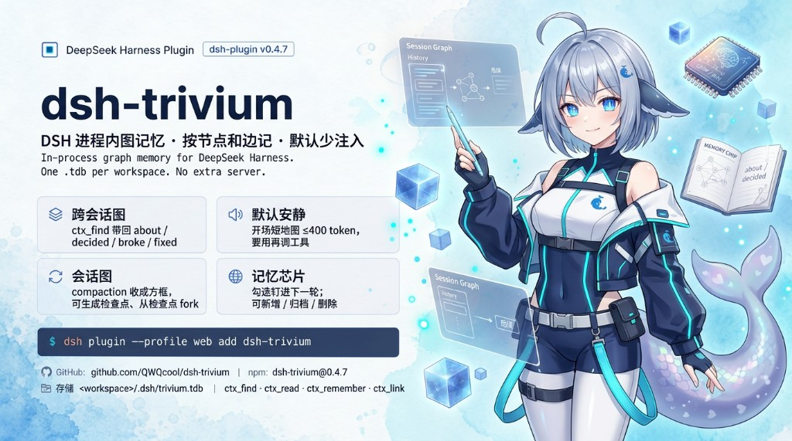
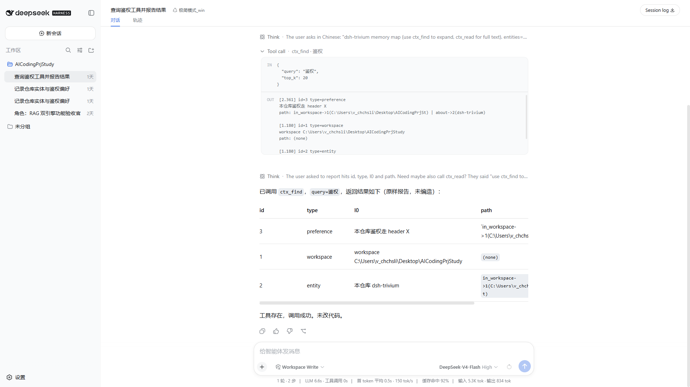
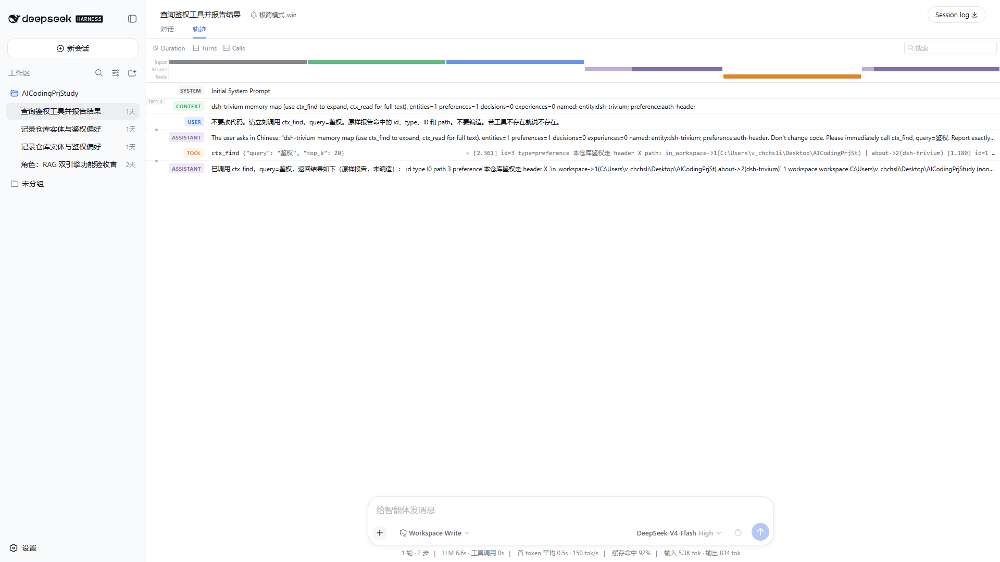
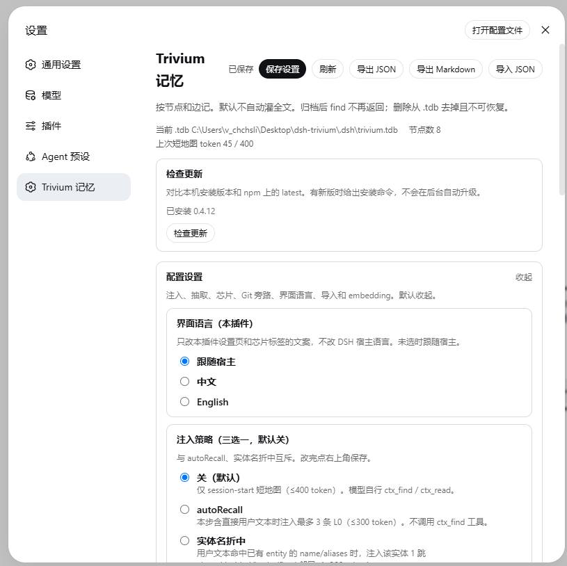
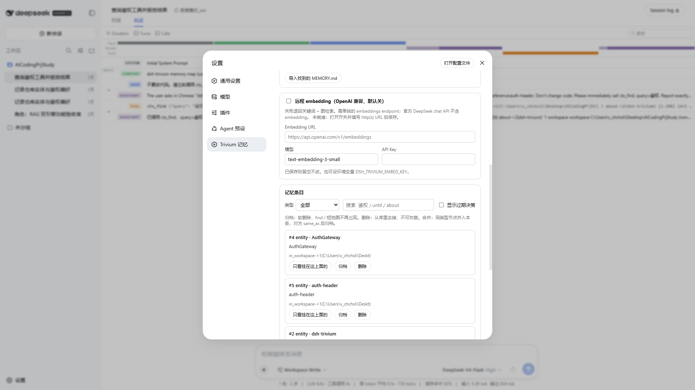
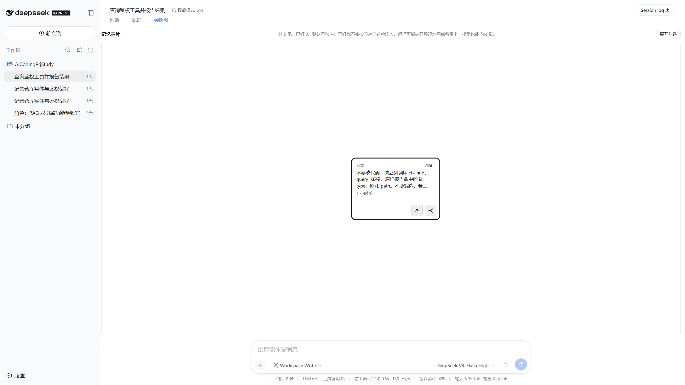

# dsh-trivium — In-process graph memory for DeepSeek Harness

<p align="center">
  
</p>

In-process graph memory for DeepSeek Harness. One `.tdb` per workspace. No extra server.

The kernel stays close to DSH: no extra process, no extra nav by default. Pin memory fragments with optional chip inject; the plot canvas is an optional extra, loaded from Settings.

> **Quick install**: `dsh plugin --profile web add dsh-trivium` → restart **dsh web** → open a workspace (Settings shows **Trivium memory**; the **Chips** tab stays off until you turn it on). Details in [Installation](#installation).

[**English**](README.md) | [中文版](README.zh-CN.md)

---

## Installation

> Prerequisite: install [DeepSeek Harness](https://github.com/deepseek-ai/deepseek-harness) and start `dsh web` at least once. Tested host: `@deepseek-ai/dsh@0.1.1-rc.2` (`dsh-llm` / `dsh-tools` peers also accept `0.1.0-rc.8`).

```sh
dsh plugin --profile web add dsh-trivium
```

Restart **dsh web**. Memory lives in the current workspace:

```
<workspace>/.dsh/trivium.tdb
```

If you launch DSH with [Dsh_BatStart](https://github.com/QWQcool/Dsh_BatStart), the plugin is installed for you — skip the command above.

Local source checkout:

```sh
npm install
node scripts/link-dsh.mjs
```

Then restart `dsh web`.

## Updating

```sh
dsh plugin --profile web add dsh-trivium
```

Restart **dsh web**. For a source checkout, `git pull` then run `node scripts/link-dsh.mjs` again.

## Uninstall

Stop **dsh web** first so the `.tdb` is not locked, then:

```sh
dsh plugin --profile web remove dsh-trivium
```

`remove` deletes this plugin’s files: `~/.dsh/trivium.json`, and in every workspace the plugin has opened, `.dsh/trivium.tdb` plus `trivium-pending.json`. Other files under `.dsh/` stay. Updating with `dsh plugin add dsh-trivium` does **not** wipe memory.

Restart **dsh web** afterward: Settings no longer shows **Trivium memory**, the title bar no longer shows **Chips**, and the four tools are unregistered.

Workspaces never opened after this version may still have an old `.tdb`; delete that file by hand if you find one. Disable without uninstall (data stays): in that profile’s `cordis.patch.yml` add:

```yaml
- id: dsh-trivium
  disabled: true
```

Then restart `dsh web`.

## Permissions and data

The plugin loads inside the `dsh web` process. It does not open its own port or extra service.

| Access | Default | Notes |
|---|---|---|
| Workspace `.dsh/trivium.tdb` | read/write | Memory store. Do not open the same file from two Node processes at once |
| `~/.dsh/trivium.json` | read/write | Settings and chip pins; may contain an embedding API key you typed |
| `.dsh/trivium-pending.json` | read/write | Local queue when extract fails |
| Network | off | Chat text is not sent out. Embedding outbound happens only if you turn it on and fill a URL. Settings **Check for updates** fetches the npm registry (version only, no transcript) |
| Transcript | stays local | Extract and search run on this machine; with embedding on, retrieved text is sent to the URL you filled |

The official DeepSeek chat API has no embeddings endpoint. Keyword + graph walk still work without it. Restart `dsh web` after changing settings or embedding.

## AI-era installation

Copy this to your assistant:

```text
On DeepSeek Harness, run: dsh plugin --profile web add dsh-trivium
Then restart dsh web. Settings will show "Trivium memory". The Chips tab is off by default; turn it on under Settings → Trivium memory if you want to pin fragments into the next turn.
```

---

## Graph memory that stays quiet

Trivium is a memory kernel, not a journal, calendar, or chat companion. It stores **nodes and edges**, injects as little as possible, and lets you correct mistakes.

- **Cross-session graph** — session A stores “auth goes in header X”; session B calls `ctx_find("auth")` and gets the hit plus who it links to (`about` / `decided` / `broke` / `fixed`).
- **Default quiet** — a new session injects one short map (≤400 tokens). The model calls tools when it needs more. Nothing is dumped every step. No extra title-bar tab until you turn **Chips** on.
- **Chips (off by default)** — Settings → Trivium memory. When on, the title bar shows **Chips**; checked items pin into the next turn (L0, ≤300 tokens). Under it, **Session layer** (also off) draws compaction / forks as boxes.
- **Human-editable** — chips can add, archive, or delete; Settings search, rename, merge, import/export, and global switches.
- **Strict extraction** — chitchat, one-off file edits, and secrets are **not** auto-written from the transcript. Chip “Add” stores exactly what you typed (one paste = one node), still through the write hygiene gate.
- **Write hygiene** — `ctx_remember`, chip add, extract, and external import refuse mojibake, stutter loops, JSON envelopes, base64 residue, and secrets. Dirty nodes already in `.tdb` stay visible in Settings so you can archive them; they are hidden from find / short map / chips.
- **Optional embedding** — off by default. The official DeepSeek chat API has no embeddings endpoint; fill an OpenAI-compatible URL if you want one. Keyword + graph walk still work without it.

### Under the hood

- **In-process, one file** — TriviumDB (vectors + JSON payload + directed weighted graph) opens with the DSH process. No sidecar HTTP/Python service.
- **Four tools only** — `ctx_find` / `ctx_read` / `ctx_remember` / `ctx_link`. Chips / session layer do not add a fifth.
- **Injection via `agent.inject()`** — not the system prompt, so `persona.complete: true` cannot silently drop the map.
- **Recall carries paths** — every hit says which node it came from and along which edge.
- **Failures never block the agent** — store / embedding / extract errors are logged; the main loop continues.
- **UI follows the host language** — Settings and the Chips tab switch with DSH `locale/change` (`zh` / `en`).
- **First-turn map** — the short map is injected once per session. If `session-start` loses a race with the first model step, `pre-step` fills it in; it is not rewritten every step (prefix-cache friendly).

## Features

### Cross-session graph

Nodes are `entity` / `preference` / `decision` / `experience`. Business edges are `about`, `decided`, `broke`, `fixed`.

`ctx_find` returns L0 summaries plus edge paths (incoming as `<-label-id`). If the query names an existing entity, unexpired `about` / `decided` / `broke` / `fixed` neighbors come along even when the neighbor text does not contain the query. Decisions with `until` stay hidden after they expire, unless the query itself is asking about that deadline (e.g. “Friday”).

### Chips (optional)

Off by default. Turn on **Chips tab** in Settings, then restart `dsh web`. The title bar shows **Conversation / Trajectory / Chips**. This is a pin strip, not the memory editor. Rename, merge, and global switches stay on the Settings page.

Lists unarchived preference / decision / entity (experience stays out). Check to pin into the next turn (L0, ≤300 tokens). Add / archive / delete on the strip.

| Action | When it takes effect |
|---|---|
| Check a chip | The **next** message you send in this segment carries it (L0, ≤300 tokens) |
| Uncheck | The turn after that no longer carries it |
| Add | One click writes one node; a whole paste is still one node |
| Select → Archive | Soft delete: gone from find / short map / chips; the node remains in `.tdb` |
| Select → Delete | Removed from `.tdb`, not recoverable |
| Turns already sent | Not rewritten |

Chips are per session. New sessions and forked children start unchecked. Inherit pins when the session layer fork dialog is on, or check them again on the child. The short map still arrives at session-start and does not use a chip slot.

**Session layer** is a nested switch, also off. When on, the same tab draws compaction / fork boxes (Create checkpoint, Update checkpoints, fork from a box). Episode nodes are not recalled by `ctx_find`. Turning the layer off stops writing episodes; existing `.tdb` nodes stay.

### Settings (Trivium memory)

Settings → **Trivium memory** manages the store and the two optional surfaces.

- **Chips tab (default off)** — title-bar **Chips** + pin inject. Restart `dsh web` after save.
- **Session layer (default off, under Chips)** — plot canvas. Requires the Chips tab.
- **Injection (pick one, default off)** — Off: short map at start only. autoRecall: at most 3 L0 hits when the step has user text. Entity-name middle path: 1-hop business neighbors only when the utterance names an existing entity. Checked chips share the budget and win first.
- **Extraction** — default after `compaction/end` and a short idle; failures go to pending and replay on the next session-start. Per batch: body ≤3000 chars, at most 24 items.
- **Entries** — search, filter by type, expand business-edge neighbors, “only nodes hanging on this one”, hide expired decisions by default. Rename / edit body / aliases / until, merge same type, archive or delete.
- **Export / import** — JSON is a real round-trip. Markdown is a read-only projection (for people and git), not parseable back. One-shot strict import from WorkBuddy `MEMORY.md`, Claude Code `CLAUDE.md`, and Codex `AGENTS.md`. No watch, no session jsonl, no two-way sync.
- **Check for updates** — Settings compares the installed version with npm latest and shows `dsh plugin --profile web add dsh-trivium` when a newer version exists. It does not auto-upgrade.
- **Embedding** — off by default. Turn on and fill an OpenAI-compatible URL; failures fall back to keyword + graph. Restart `dsh web` after changing settings.

### Agent tools

| Tool | What it does |
|---|---|
| `ctx_find` | Search; L0 summaries and graph paths (incoming `<-label-id`). Entity-name queries also return unexpired about/decided/broke/fixed neighbors. Expired `until` decisions stay out unless the query asks about the deadline |
| `ctx_read` | Full text and incoming edges by id |
| `ctx_remember` | Manual write |
| `ctx_link` | Directed edge between two nodes |

The kernel is still these four. Chips / session layer do not add a fifth tool.

---

## Screenshots

Captured inside DSH Web (`0.1.1-rc.2`). Screenshots below are from the Chinese UI; the plugin follows the DSH host language (`zh` / `en`).

### Conversation — `ctx_find("鉴权")`



Session-start injects the short map; the model calls `ctx_find` and hits “auth in this repo goes in header X”.

### Trajectory — injection is visible



### Settings — injection strategy



### Settings — memory entries



### Chips tab — optional, next to Conversation / Trajectory



Off by default. After you turn **Chips** on in Settings and restart, the title bar shows **Chips**. With **Session layer** also on, a never-compacted session has one “Next” box; chips sit on top (unchecked by default). **Create checkpoint** folds “Next” into a left box. After compaction or `/compact`, historical boxes appear on the left; forks leave a box toward a child session.

---

## Limitations

- If the model never calls `ctx_find` and no chips are checked, the window is mostly the opening short map.
- Extraction misses things; dirty data can be archived / deleted on the chip strip or edited / merged in Settings.
- Do not open the same `.tdb` from two Node processes at once (one `dsh web` is enough).
- Markdown export is for humans; it cannot be parsed back. External import (WorkBuddy / Claude Code / Codex) is one-shot, not two-way sync, and does not ingest session jsonl dumps.
- The session layer (when on) projects compaction and fork; it does not split boxes by message count. If the window has not reached DSH’s compact line, **Update checkpoints** will not invent history boxes — use **Create checkpoint**.
- Plugin setting changes need a `dsh web` restart.
- After the host moved to rc.8, DSH’s own older session store may not open (official SQLite format change). The workspace `.tdb` graph is still there; leftover boxes on unmatched old sessions are plot residue and do not affect `ctx_find`.

---

## Changelog

**0.4.10** — `dsh plugin remove` deletes known workspace `.tdb` files and `~/.dsh/trivium.json`. Plugin update does not wipe. Disable-in-place still keeps data.

**0.4.9** — Chips tab and session-layer canvas are both off by default. Title bar shows **Chips** only after the Settings switch; session boxes sit under that switch. Kernel (four tools, short map, in-process `.tdb`) unchanged.

**0.4.8** — Write + inject hygiene gate (secrets, mojibake, stutter, JSON envelopes, base64 residue). Settings / session graph follow DSH language. Settings can check npm for updates. One-shot strict import also discovers Claude Code `CLAUDE.md` and Codex `AGENTS.md`. First-turn short map is guaranteed if `session-start` races the first step.

**0.4.7** — Storage bump to `triviumdb@0.7.6` (`searchExact` / `searchBatch` on the engine). find / session graph behavior unchanged.

**0.4.6** — Session graph **Create checkpoint**: fold the current “Next” into a left box. Does not trigger DSH compaction.

**0.4.5** — Host peers widened to `0.1.0-rc.8` and `0.1.1-rc.2`; no nested old `dsh-llm` / `dsh-tools`.

**0.4.4** — `triviumdb@0.7.5`: incoming edges, expand-by-label, delete-by-label go through engine APIs instead of scanning all edges. find / session graph behavior unchanged.

**0.4.3** — Session graph **Update checkpoints**: backfill DSH compression markers and sidebar forks for sessions that existed before the plugin. Never-compacted sessions still have only “Next”.

**0.4.2** — Chip strip can add (one paste = one node) and batch archive / delete. Auto-extract stays strict; chip add writes what you typed.

**0.4.1** — Host pinned to `@deepseek-ai/dsh@0.1.0-rc.8`. Same features as 0.4.0. Confirmed on rc.8: Settings “Trivium memory”, new-session short map, cross-session `ctx_find`, session graph tab.

**0.4.0** — Session graph, memory chips, fork from a checkpoint.

## Troubleshooting

| Symptom | What to do |
|---|---|
| Settings has no **Trivium memory** | Confirm the **web** profile, then **restart** `dsh web` and open a workspace. Reloading the browser is not enough. |
| Title bar has no **Chips** | Expected. Turn on **Chips tab** in Settings, save, then restart `dsh web`. |
| Injection / extract / embedding / chip tab changes have no effect | Restart `dsh web` as well. |
| Session layer shows only a **Next** box | Expected when the nested session layer is on. Boxes follow DSH compaction; a long session is not the same as already compacted (auto-compact is around 80% of the window). To split: `/compact` in the conversation, or **Create checkpoint** (plot only, does not compact the window). Older sessions can use **Update checkpoints** to backfill past compaction / forks. |
| `ctx_find` returns nothing | A new session injects the short map only; the model must call the tool. You can also **Add** on the chip strip or tell the model “remember: …”. Chitchat and one-off file edits are not auto-written. |
| `.tdb` is locked / will not open | Run one `dsh web`. Do not run two Node processes that both linked this plugin. |
| Embedding is filled but search is no more accurate | Failures fall back to keyword + graph. Check that `~/.dsh/trivium.json` has an OpenAI-compatible URL (the `/v1` kind). Restart after changing it. |
| Memory still there after uninstall | Stop `dsh web` before `dsh plugin remove`. Leftover `.tdb` is a workspace never opened on 0.4.10+; delete `.dsh/trivium.tdb` in that folder. Disable-in-place does not wipe. |
| Check for updates fails | That request only hits the npm registry for the latest version. Memory is unaffected; try again later. |
| Old conversations will not open after rc.8 | That is DSH’s own session-store format change, not a broken `.tdb`. Graph memory still works via `ctx_find`; leftover boxes on unmatched old sessions are plot residue. |

Local source checkout: `npm install`, then `node scripts/link-dsh.mjs`, then restart `dsh web`. `triviumdb` is a native module; if it will not install, check Node against `package.json` `engines` (`^22.19.0 || >=24`).

---

## Release info

- GitHub: https://github.com/QWQcool/dsh-trivium
- npm: [`dsh-trivium@0.4.10`](https://www.npmjs.com/package/dsh-trivium)
- Tested host: `@deepseek-ai/dsh@0.1.1-rc.2` (also `0.1.0-rc.8`)
- License: MIT (depends on [TriviumDB](https://github.com/YoKONCy/TriviumDB), Apache-2.0)

---

## Acknowledgements

Parts of the write hygiene gate, npm update check, host-locale UI switching, and Claude Code / Codex file discovery were adapted from [dsh-auto-memory](https://github.com/Aik358/dsh-auto-memory) (Aik358). The product stays a graph kernel (nodes, edges, four tools, quiet default) rather than a journal / calendar companion.
