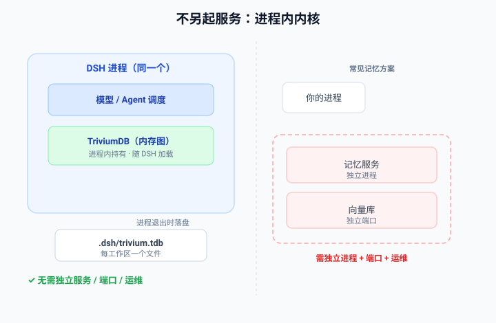
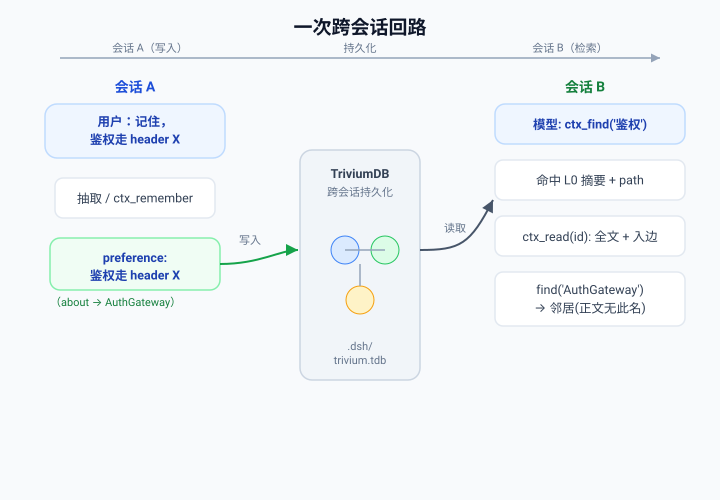
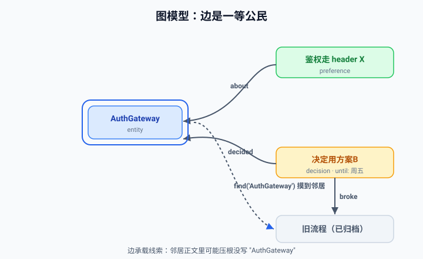
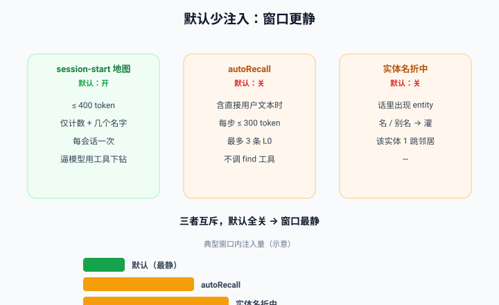

<!--
标题（选一）：窗口更静，边还在：用 dsh-trivium 给 DeepSeek Harness 补上跨会话图记忆
摘要：DSH 原装无跨会话图记忆。dsh-trivium 是进程内内核：不另起服务、每工作区一个 .tdb、图边一等公民、默认少注入、人能改错，还能和 WorkBuddy MEMORY.md 互导。
标签：DeepSeek / 大模型 / Agent 记忆 / 插件开发 / 图数据库
-->

# 窗口更静，边还在：用 dsh-trivium 给 DeepSeek Harness 补上跨会话图记忆

> dsh-trivium 0.3.0 —— 装上就有跨会话记忆，不另起服务

在 DeepSeek Harness（DSH）里磨合了一轮，把「鉴权走 header X」教明白了；关掉窗口、第二天再来，它又变回白纸。DSH 把「一切皆插件」做得干净，但原装运行时**没有跨会话的图记忆**——实体、偏好、决策留在那一次窗口里。

dsh-trivium 是补这一块的**进程内内核**：不是侧栏、不是工作台、不拷源码。它随 DSH 进程加载 TriviumDB，每个工作区一个文件 `<workspace>/.dsh/trivium.tdb`，**不另起服务**。

---

## 1. 为什么不另起服务

很多方案默认「再跑一个服务 + 向量库」，带来端口、进程、运维三件套。dsh-trivium 在 DSH 进程里直接持有内存图，退出时落盘到 `.dsh/trivium.tdb`（见图 1）。一个工作区一个文件，git 也能跟着走。



| 设计选择 | dsh-trivium | 常见默认 |
| --- | --- | --- |
| 运行形态 | 进程内内核，单文件 `.tdb` | 独立服务 + 向量库 |
| 接口 | 4 个工具，固定 | 往往更多 / 变动 |
| 默认注入 | 少（≤400 token 地图） | 每步自动灌 |
| 记忆结构 | 图（边一等公民） | 扁平片段 / 向量 |
| 人能改错 | JSON 真回写 + 可视化 | 视实现 |

---

## 2. 一次完整回路

会话 A：用户说「记住，鉴权走 header X」，抽取或 `ctx_remember` 写入 preference，用 `about` 挂到实体 AuthGateway。会话 B：模型 `ctx_find("鉴权")` 命中，返回 L0 摘要 + 实体 path；`ctx_read(id)` 取全文和入边；`find("AuthGateway")` 还能打到正文里根本不出现该名的邻居（见图 2）。记忆在进程内的图里常驻，不在 prompt 里接力。



---

## 3. 图模型：边是一等公民

节点分实体 / 偏好 / 决策三类；边是内置语义：`about`、`decided`、`broke`/`fixed`、`until`（决策截止日，过期默认不进 find，除非查询在问这个期限）。图检索按实体摸到邻居，关系本身承载线索（见图 3）。



## 4. 四个工具，没有第五个

```text
ctx_find     检索：L0 摘要 + 实体 path
ctx_read     按 id 读全文与入边
ctx_remember 显式写入
ctx_link     建边
```

## 5. 默认少注入：窗口更静

- **session-start 地图（默认开）**：开头只灌 ≤400 token 的短地图（计数 + 几个名字），逼模型用工具下钻。
- **autoRecall / 实体名折中（默认关）**：含直接用户文本时最多灌 3 条 L0，或话里出现实体名才灌 1 跳邻居。

三者互斥，默认全关。动态记忆走 `agent.inject()`，不写 system prompt，避免 `persona.complete: true` 把注入静默丢掉（见图 4）。



## 6. 人能改错，比「再做个日记面板」有用

Settings「Trivium 记忆」可搜、看邻居、改名改正文、合并同类型节点、归档删除。**JSON 导入导出是真回写**；Markdown 导出是只读投影（行如 `- 鉴权走 header X —about→ AuthGateway`），别拿它当回写格式。

---

## 7. 实操：和 WorkBuddy MEMORY.md 互导

如果你同时用 WorkBuddy，两边记忆可以一次性互通——但**不是持续双向同步**，只是单向迁移，之后各自演进。

**方向一：WorkBuddy → dsh-trivium（严导入）**
1. 在 Settings 选「从 MEMORY.md 导入」，指向 `~/.workbuddy/MEMORY.md`（用户级）或项目 `.workbuddy/memory/MEMORY.md`。
2. 导入器跳过闲聊、一次性改文件记录、密钥、无线索段落；只留可作实体 / 偏好 / 决策的条目。
3. 限写保护：每批正文 ≤3000 字、最多 24 条。
4. 导入后导出 JSON 校验，节点与边确实落进 `.dsh/trivium.tdb`。

**方向二：dsh-trivium → WorkBuddy（投影）**
1. 用 Settings「Markdown 导出」拿到只读投影。
2. 把需要的条目整理进 WorkBuddy 的 MEMORY.md——这是**人读格式**，不是回写格式，别直接当反向导入。要真回写请走 JSON 导出再合并。

> 提醒：抽取与导入都偏严会漏，导入后建议扫一遍邻居、手动补 `about` 边把偏好挂到正确实体上。

---

## 8. 可选远程 embedding（默认关）

官方 DeepSeek chat API 没有 embeddings，也没有本地模型。你可填 OpenAI 兼容 URL 开远程向量化，但**不开也能用**：关键词 + 图遍历。调用失败只记日志，Agent 继续。

## 9. 我们实测了什么，没实测什么

- **实测过**：同一插件装着，空库上 `ctx_find("鉴权")` 打不出跨会话 preference——「装上之前没有、装上之后有」这件对照是验证过的。
- **没做过**：没有 live OpenViking bake-off，也没有 LoCoMo / L0–L2 分数。机制可以比，分数不要编。

## 10. 限制（按字面读）

不是工作台：无图谱画布、无侧栏、无跨 Agent 共享、无 PDF/Zotero RAG。默认不自动召回——模型不调 `ctx_find` 窗口就只有短地图。抽取偏严会漏。同一 `.tdb` 别被两个 Node 进程同时打开。第一期不做：默认每步自动召回、本地 embedding、第五工具、OV 评测农场。

---

## 装上试试

```bash
dsh plugin --profile web add dsh-trivium
# 或
dsh plugin --profile web add github:QWQcool/dsh-trivium
```

重启 `dsh web`，打开工作区。别把本仓库拷进 DeepSeek_Harness——它是插件，不是补丁。

- 仓库：github.com/QWQcool/dsh-trivium
- npm：`dsh-trivium`（0.3.0），MIT
- 钉死：`@deepseek-ai/dsh@0.1.0-rc.6`

---

给已经在用 DSH 的人：无额外服务、默认少注入、图带边、人能改错、装上就有跨会话记忆。窗口更静，边还在。

---

<!-- ========== 发布建议，发布前删除 ==========
标题方案：A.窗口更静，边还在：用 dsh-trivium 给 DeepSeek Harness 补上跨会话图记忆（推荐） B.不另起服务的 Agent 图记忆：dsh-trivium 0.3.0 实践 C.DeepSeek Harness 记不住事？进程内补一块 dsh-trivium
标签：DeepSeek / 大模型应用 / Agent 记忆 / 插件开发 / 图数据库
配图：除 4 张 SVG 外，第 6 节最该补 1–2 张 Settings「Trivium 记忆」界面截图。
格式：平台不支持 SVG 时，浏览器把 figures/*.svg 另存为 PNG 再传。
当前约 1700 字，中篇偏短、首屏友好；如要更长可把第 9 节诚实边界展开成两段。
============================================ -->
